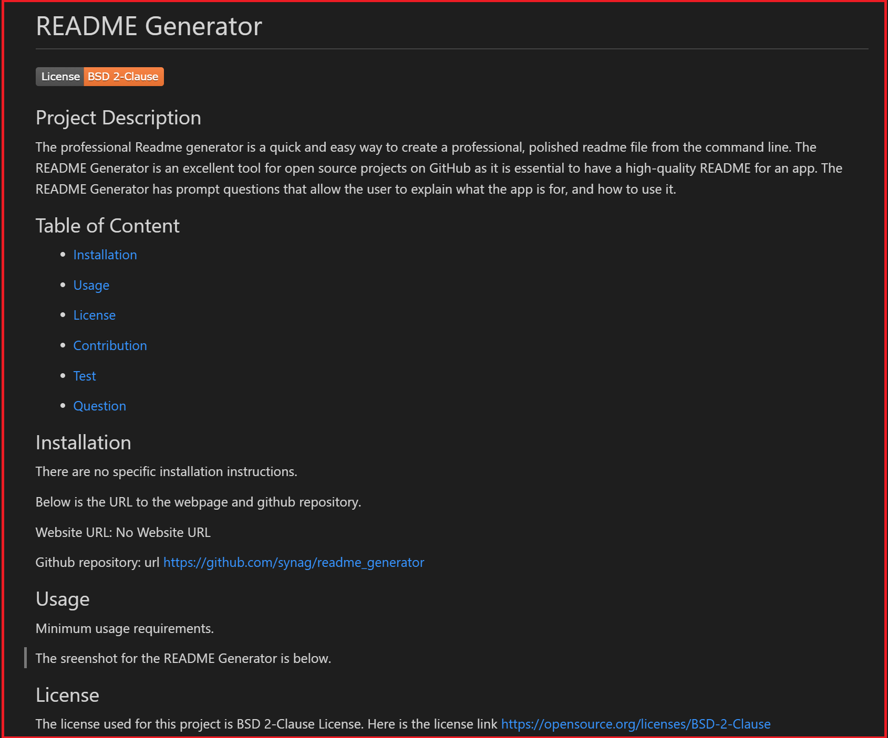

 
# README Generator   

## Project Description 
The professional Readme generator is a quick and easy way to create a professional, polished readme file from the command line. The README Generator is an excellent tool for open source projects on GitHub as it is essential to have a high-quality README for an app. The README  Generator has prompt questions that allow the user to explain what the app is for, and how to use it.

## Table of Content

* [Installation](#installation)

* [Usage](#usage)

* [License](#License)

* [Credits](#Credits)

* [Contribution](#Contribution)

* [Test](#Test)

* [Question](#Question) 

## Installation
There are no specific installation instructions.

Below is the URL to the webpage and github repository. 

Website URL: No Website URL

Github repository: https://github.com/synag/readme_generator

## Usage
Minimum usage requirements.

The sreenshot for the README Generator  is below. 

## License
The license used for this project is BSD 2-Clause License. Here is the license link https://opensource.org/licenses/BSD-2-Clause

## Credits
No team members worked on this project and the tools used were HTML, Markdown, Node inquirer, JavaScript.

Third-party resources used were node inquirer, and markdown resources websites.

## Contribution
Review the contribution playbook and adhere to our contribution standards.

## Test
No test instructions

## Questions
Please contact me with any questions.  

* Github username: synag
* Github URL: https://github.com/synag
* Email:  cbenbow82@gmail.com 